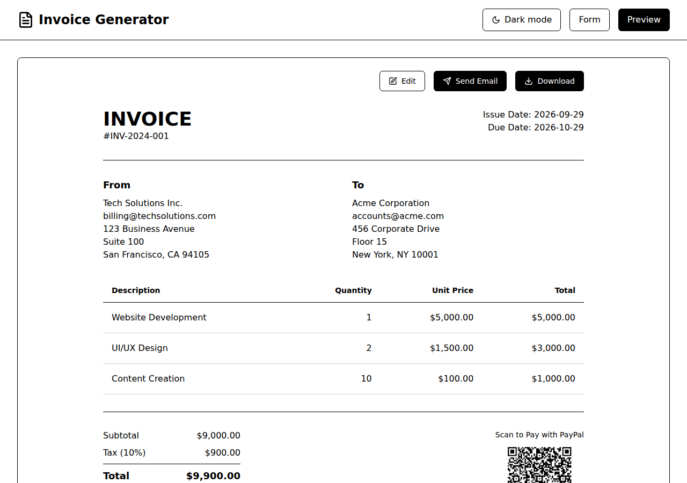

# Invoice Generator

A single-page invoice generator: fill in the business and the client, add line items, set a tax rate and a currency, preview, download the PDF. A PayPal.me link becomes a QR code on the invoice. Nothing leaves the browser: there is no backend and no account.



**Status:** maintained as a utility, not a product. Dependencies are kept current (Dependabot is on); features are added when someone needs them.

## Features

- Business and client details, with an optional logo upload.
- Line items with quantity and unit price; subtotal, tax and total computed as you type.
- Tax rate per invoice, including 0% for exempt or reverse-charge invoices.
- Currency selection with locale-aware formatting.
- Automatic invoice numbering, invoice and due dates, free-text notes.
- Preview, PDF download (jsPDF), and a QR code for the PayPal.me payment link.
- Light and dark mode; responsive layout.

The "Send by email" button only simulates a send: there is no mail service behind the app. Download the PDF and attach it.

## Quickstart

```bash
git clone https://github.com/ElecteSrl/invoicegenerator.git
cd invoicegenerator
npm install
npm run dev
```

Open http://localhost:5173. `npm run build` writes a static site to `dist/`; `npm run lint` runs ESLint.

## Stack

React 18, TypeScript, Vite, Tailwind CSS, jsPDF + jspdf-autotable, qrcode, Lucide icons, react-hot-toast.

## Project structure

```
src/
├── components/   # InvoiceForm, InvoicePreview, CurrencySelector, LogoUpload
├── utils/        # pdf.ts, qrcode.ts, currencies.ts, email.ts, sampleData.ts
├── types.ts
└── App.tsx
```

## License

[MIT](LICENSE) © ELECTE S.R.L.
